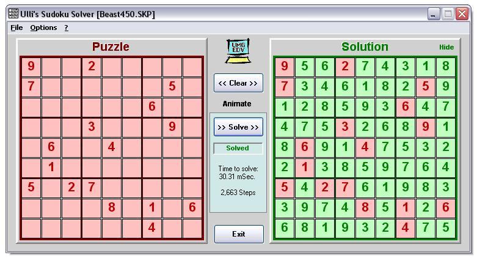



## Ulli's Sudoku Solver \(4x faster again\)

### Description

This is an object-oriented Sudoku Solver combining the "cross hatching" strategy with a backtrack algorithm. It solves easy puzzles in about 600 &#181;secs and really hard ones usually in under 150 msecs (when compiled) on my old AMD Athlon XP1800+. The most evil one I could find is in the screen shot.
 
### More Info
 

             |
---                |---
**Submitted On**   |2008-02-23 17:59:14
**By**             |[ULLI](https://github.com/Planet-Source-Code/PSCIndex/blob/master/ByAuthor/ulli.md)
**Level**          |Advanced
**User Rating**    |5.0 (95 globes from 19 users)
**Compatibility**  |VB 6\.0
**Category**       |[Math/ Dates](https://github.com/Planet-Source-Code/PSCIndex/blob/master/ByCategory/math-dates__1-37.md)
**World**          |[Visual Basic](https://github.com/Planet-Source-Code/PSCIndex/blob/master/ByWorld/visual-basic.md)
**Archive File**   |[Ulli's\_Sud2103312252008\.zip](https://github.com/Planet-Source-Code/ulli-ulli-s-sudoku-solver-4x-faster-again__1-70078/archive/master.zip)

### API Declarations

a few

